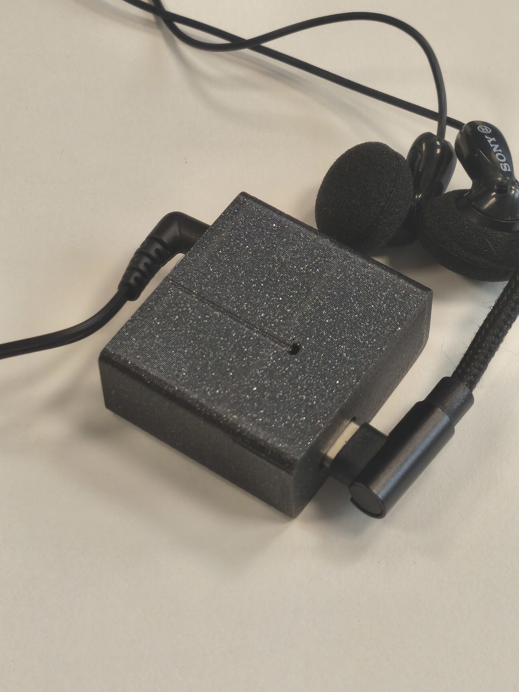
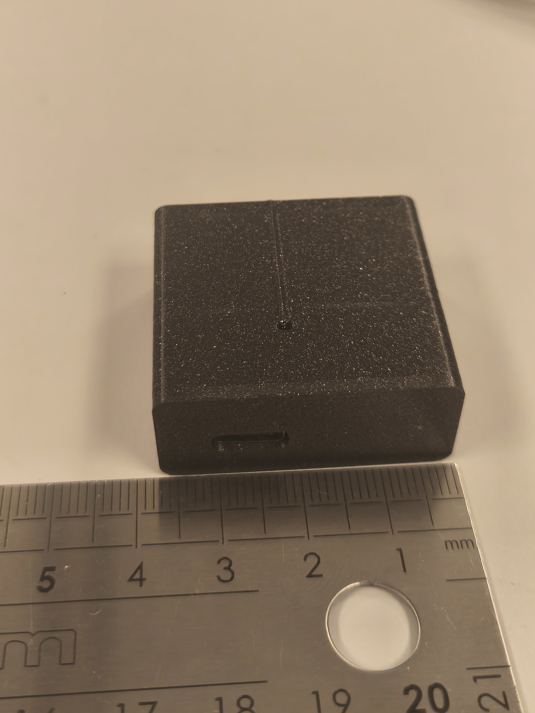
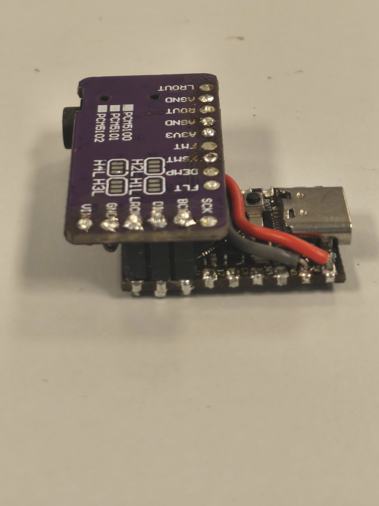

# Tasmota Web Radio Mini

**Arguably the world's most compact Tasmota-based web radio streamer.**
An ESP32-S3 + PCM5102A internet radio that fits in a **33 × 36 × 15 mm** 3D-printed
case, powered over USB-C, with line / headphone output and full control from a
web browser.

---

## Highlights

- **Tiny.** 33 × 36 × 15 mm printed enclosure — about 18 cm³.
- **Real line / headphone output** via a PCM5102A I2S DAC (3.5 mm jack).
- **USB-C powered**, native USB (no serial adapter needed for flashing).
- **Browser-controlled** web UI — no app required.
- **Station search** powered by the [Radio Browser](https://www.radio-browser.info/) API, with favorites.
- **RGB status LED** (red = boot, blue = WiFi connected, green = AP config mode).
- Runs a **customized Tasmota firmware** with three audio fixes (see below).

---

## Hardware

Two stacked breakout boards inside a two-part printed case.

- **Controller:** ESP32-S3 Super Mini (PSRAM, USB-C, onboard WS2812 LED)
- **DAC:** PCM5102A I2S module with 3.5 mm jack

See [`hardware/bom.md`](hardware/bom.md) for the full bill of materials and
[`hardware/wiring.md`](hardware/wiring.md) for the wiring.

### Key wiring

| ESP32-S3 GPIO | PCM5102A | Signal |
|---------------|----------|--------|
| GPIO10 | BCK  | I2S bit clock |
| GPIO9  | DIN  | I2S data |
| GPIO8  | LRCK | I2S word select |

Power: 5 V -> DAC `VIN`, common `GND`. The DAC's `XSMT` pin is strapped to `A3V3`
for permanent hardware un-mute. `SCK` is left unconnected (internal PLL).

---

## 3D-printed case

Printable files are in [`3d/`](3d/) (case main + cover).
Enclosure size: 33 × 36 × 15 mm.

---

## Firmware

This project runs a **customized fork of Tasmota** with three audio improvements
over the stock `WebRadio` implementation:

1. **Perceptual volume mapping** — remaps the volume range so low settings are
   actually quiet and the top of the range doesn't clip the DAC.
2. **ICY anti-chunk validation** — validates the ICY metadata stream alignment
   before decoding, avoiding glitches on some stations.
3. **DLNA track transition fix** — advances to the next track at end of stream
   during DLNA playback.

> **Firmware source (GPLv3):** _fork link coming soon._
> This firmware derives from [Tasmota](https://github.com/arendst/Tasmota),
> licensed under GPLv3. The complete corresponding source will be published as a
> Tasmota fork.

Pre-built binaries are in [`firmware/`](firmware/):

- `tasmota32s3superminiwebradio.factory.bin` — full image, flash over USB at offset 0
- `tasmota32s3superminiwebradio.bin` — application image, for OTA upload

---

## Installation

Full step-by-step guide: [`docs/installation.md`](docs/installation.md).

Short version:

1. **Flash stock Tasmota** with the [Tasmota web installer](https://tasmota.github.io/install/)
   (ESP32-S3 variant, erase enabled).
2. **Join WiFi** — connect to the `tasmota-xxxx` access point, enter your network
   credentials, note the device IP.
3. **Upgrade to the web radio firmware** — Firmware Upgrade -> file upload ->
   `firmware/tasmota32s3superminiwebradio.bin`.
4. **Apply the template** — Configuration -> Configure Other -> paste the template
   from [`config/`](config/), tick **Activate**, enable **HTTP API**, Save.
5. **One-time setup** — in the console, run the commands from
   [`config/`](config/) (`SwitchMode1 1`, `SetOption55 1`, `Hostname webradio1`).
6. **Upload the filesystem** — copy the files from [`filesystem/`](filesystem/)
   (including the `webradio/` subfolder) via **Tools -> Manage File system**.
7. **Reboot** — the web UI is then available at `webradio1.local/webradio`.

Files are kept as individual files (not packed) so you can edit the UI and Berry
scripts directly from the Tasmota file manager.

---

## Web UI

Open `http://webradio1.local/webradio` (or the device IP + `/webradio`).
Search stations via Radio Browser, play, and manage favorites.

---

## Known issues / Help wanted

- The Radio Browser server is currently **hard-coded** — it should resolve and
  pick a mirror from `all.api.radio-browser.info` for resilience.
- **Occasional glitches** on station transitions on some streams.
- The web UI has room for **UX improvements**.

Contributions and issue reports are welcome.

---

## Acknowledgements

Many thanks to **Theo Arends** for the amazing [Tasmota](https://tasmota.github.io/docs/)
project, which this web radio is built on.

- Tasmota website & docs: <https://tasmota.github.io/docs/>
- Tasmota on GitHub: <https://github.com/arendst/Tasmota>
- Theo Arends: <https://github.com/arendst>

---

## License

GPLv3 — see [`LICENSE`](LICENSE).
This project's firmware derives from [Tasmota](https://github.com/arendst/Tasmota) (GPLv3).
