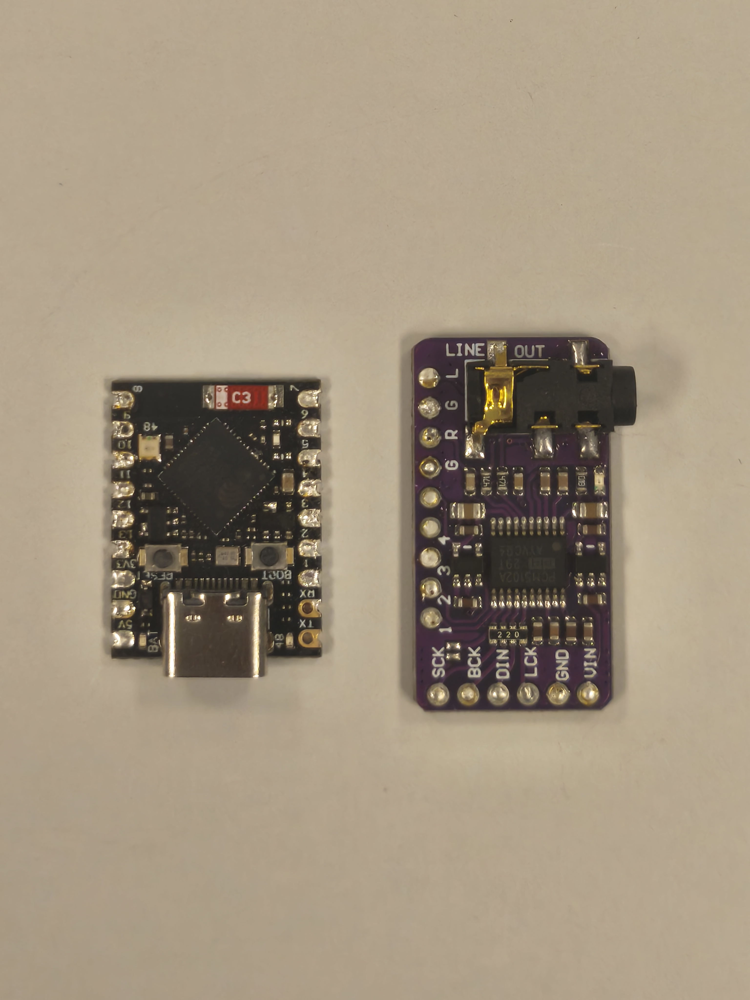
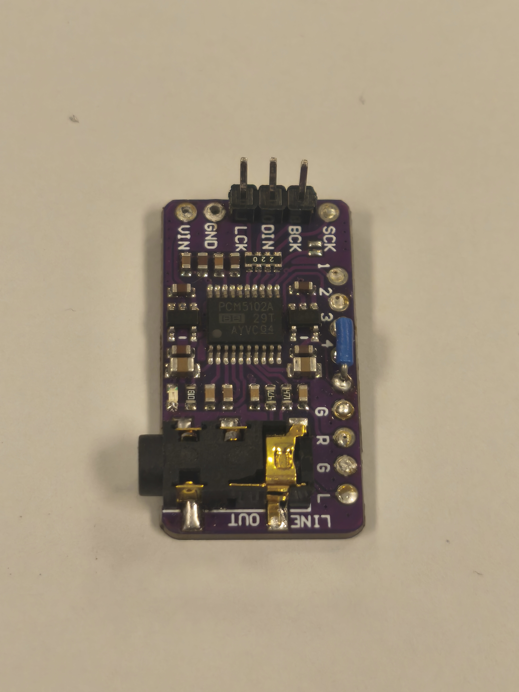
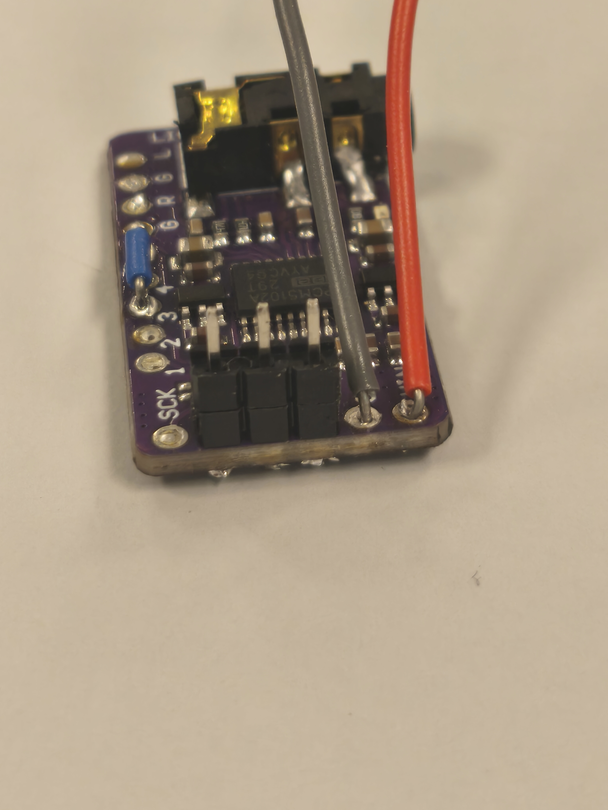
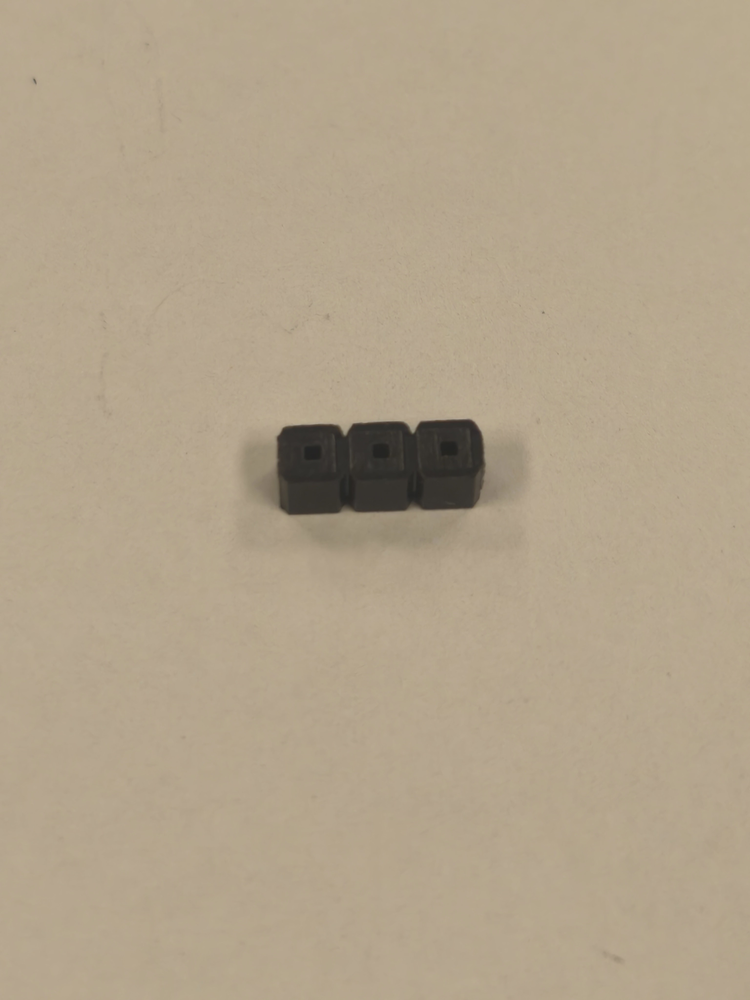
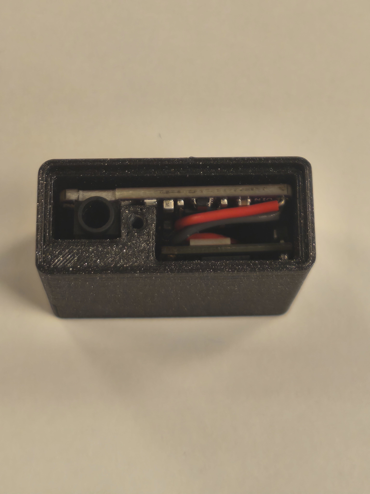
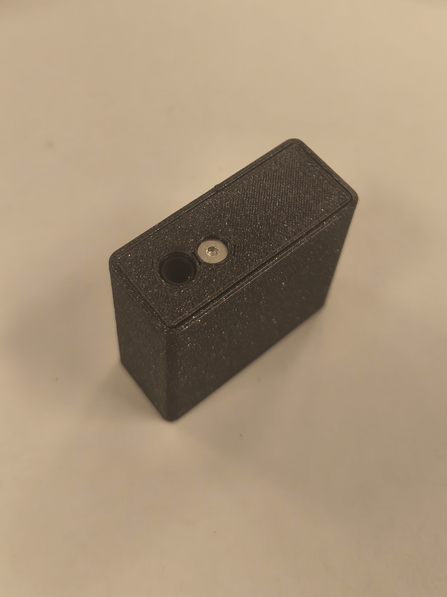

# Assembly guide

How to build the Web Radio Mini before flashing it.
Full pin-by-pin details are in [`hardware/wiring.md`](../hardware/wiring.md);
the photos below show the key steps.

---

## Modules

Two boards are stacked: the ESP32-S3 Super Mini (controller) and the PCM5102A
I2S DAC.

---

## DAC configuration strap

Solder a strap from `A3V3` to `XSMT` on the PCM5102A. This keeps the DAC
permanently un-muted (and frees a GPIO).

---

## Power wiring

Feed the DAC from the Super Mini's **5 V** pin (`VIN`) and share **GND**.
The DAC's onboard regulator produces the 3.3 V it needs internally.

---

## I2S wiring

Wire the three I2S lines from the ESP32-S3 to the DAC:

| ESP32-S3 GPIO | PCM5102A | Signal |
|---------------|----------|--------|
| GPIO10 | BCK  | Bit clock |
| GPIO9  | DIN  | Data |
| GPIO8  | LRCK | Word select |

`SCK` on the DAC is left unconnected (internal PLL).

---

## Stacking the boards

A plastic connector body (pins removed) is reused as an insulating spacer
between the two boards.

---

## Into the case

Fit the stack into the two-part printed enclosure
(files in [`3d/`](../3d/), 33 × 36 × 15 mm).

  
  

Once assembled, connect USB-C for power and continue with the
[firmware installation guide](installation.md).
